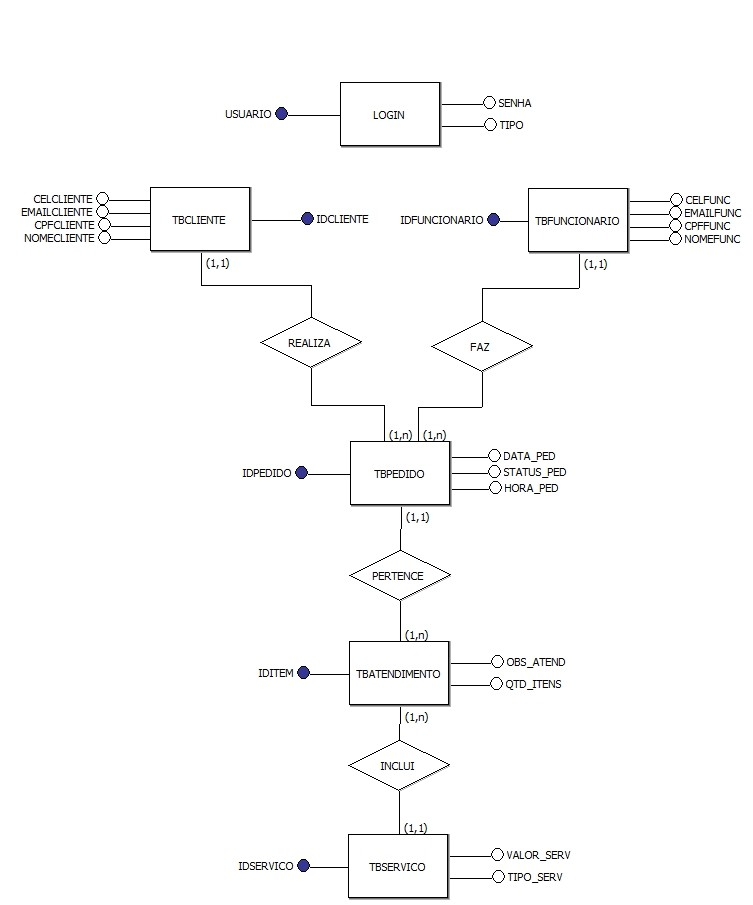
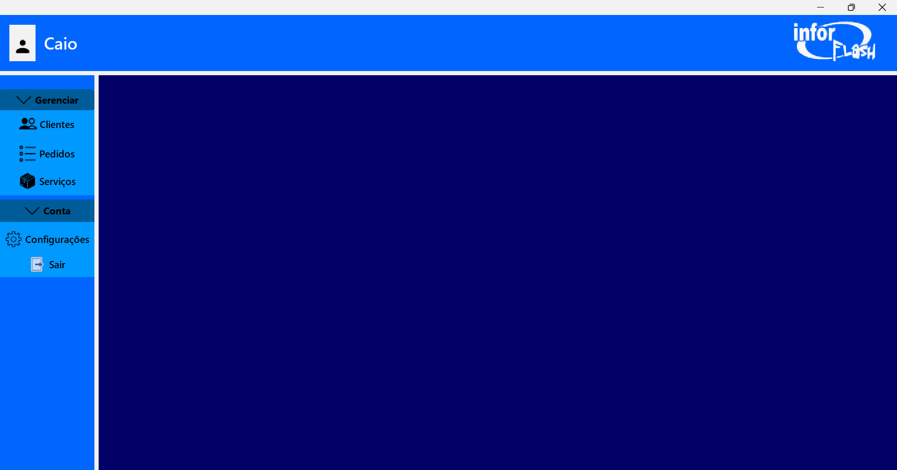

# MiniTCC2025
Aplicação CRUD em Java realizada como preparação para o TCC, utilizando uma MDI (Multiple Document Interface), uma arquitetura onde uma janela principal pode conter e gerenciar múltiplas janelas filhas.

# D.E.R. (Desatualizado) TODO: Atualizar.

# M.E.R. (Desatualizado) TODO: Atualizar.

# SQL
[⬇️ Baixar](./BDINFORFLASH_miniTCC.sql)

# Bibliotecas externas/Drivers
## Mysql
[⬇️ Baixar](./InforFlash/mysql-connector-j-9.0.0.jar)

## FlatLaf Look and Feel
[⬇️ Baixar](./InforFlash/flatlaf-demo-3.6.2.jar)

# .JAR
[⬇️ Baixar](./assets/InforFlash.jar)

# Interface

